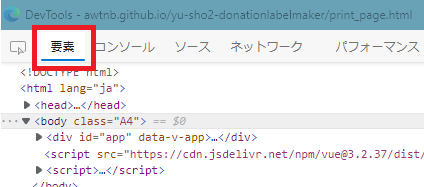
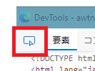
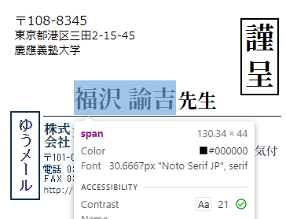
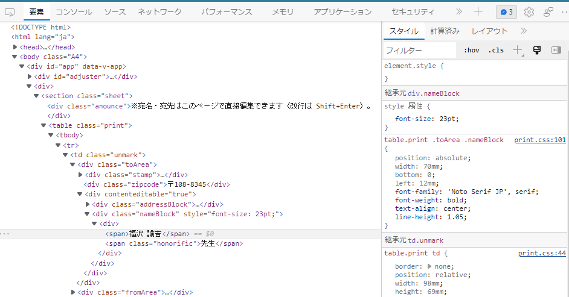
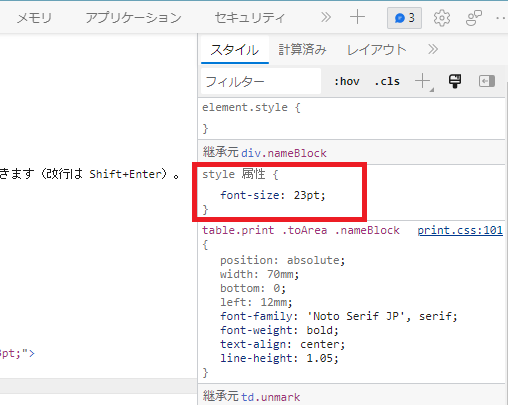
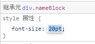

# 献本ラベルの自動生成

[github page](https://awtnb.github.io/yu-sho2-donationlabelmaker/)

[A-one ラベルシール 31267](https://www.a-one.co.jp/product/search/detail.php?id=31267)（100シート）を使用。

## サイズ微調整

※下記の操作でネット上の何かが改変されることは一切ありませんのでご安心ください。

1. ラベルの画面で <kbd>F12</kbd> を押す
1. `DevTools` というウィンドウが開くので `要素` タブを選択（環境によって色などは変わる可能性あり）

    

1. 赤枠のアイコンをクリック

    

1. 元のラベルの画面をアクティブにすると、マウスカーソルが乗った要素がハイライトされるようになるので、調整したい要素をワンクリックする

    

1. クリックすると再び DevTools のウィンドウがアクティブになる（クリックした要素、この場合は `福沢諭吉` の名前部分が選択されていることに注意）

    

1. 右の `style 属性` というのが、クリックした部分に適用されているスタイル情報（この場合は「フォントサイズ23ポイント」という意味）

    

1. フォントサイズ部分の数字を変更するとラベル上のサイズを変更できる

    

1. うまい具合に調整できたら印刷する

